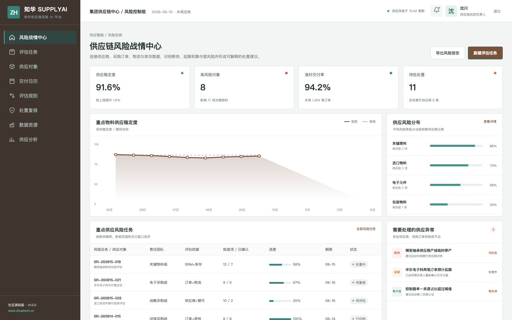
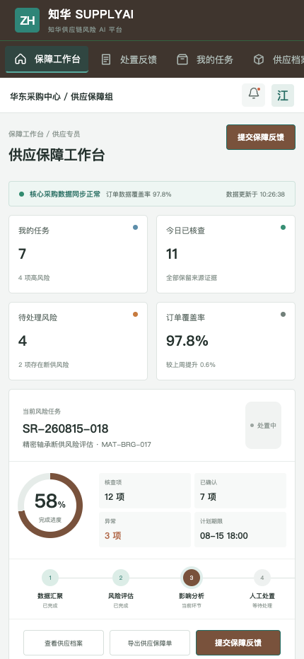

# ZhuaTech SupplyAI · 供应链风险 AI

[](backend/pom.xml)
[](frontend/package.json)
[](compose.yaml)
[](LICENSE)

供应链韧性来自更早的预警、更充分的证据和更可靠的人工处置。SupplyAI 是[知华科技（上海如静知华信息科技有限公司）](https://www.zhuatech.cn/)发布的供应链风险管理社区源码，覆盖供应商风险、订单履约、物料替代和保障协同。

## 一屏掌握供应风险



战情中心把供应稳定度、高风险对象、准时交付率、关键物料趋势、风险分布和处置任务组合成可执行视图。

## 一线供应保障



供应专员可在移动端查看当前风险、核查来源证据、提交保障反馈、查询供应档案，并对断供或集中度风险发起升级。

## 领域能力地图

```text
供应商主数据 ─┬─ 履约率 / 质量通过率
采购与物流 ───┼─ 提前期 / 在途异常
库存与物料 ───┼─ 覆盖天数 / 单一来源依赖
替代资源 ─────┴─ 风险分级 → 缓冲建议 → 人工审批 → 结果复盘
```

- `POST /api/ai/supply/assess` 输出 `STABLE / WATCH / CRITICAL`、建议缓冲天数和风险信号
- 供应商、关键物料、评估任务、交付日历、处置复核和韧性分析
- 管理端 + H5、JWT、JPA、Flyway、MySQL、H2 测试和容器编排
- 可扩展 SRM、ERP、WMS、TMS 和企业自有模型网关

Java 根包为 `cn.zhuatech.supplyai`。社区算法可本地运行且无需 API Key，供应商切换、加急采购和库存策略仍需授权人员确认。接口细节见 [docs/api.md](docs/api.md)。

## 启动与账号

```bash
cd frontend
npm install
npm run dev:demo
```

访问 `http://localhost:5173`。管理端：`planner / Demo@2026`；业务端：`operator / Demo@2026`。所有供应商、订单、人员与物料信息都是虚构演示数据。容器部署见 [deploy/README.md](deploy/README.md)。

## 重要：非商业许可

本工程仅允许个人、非商业性的学习、研究与技术交流，**不得商用**。企业内部使用、生产部署、SaaS、项目交付、收费服务、品牌替换或二次销售，必须事先取得上海如静知华信息科技有限公司书面授权，以 [LICENSE](LICENSE) 条款为准。

如需供应链系统规划、SRM/WMS/TMS 集成、AI 私有化、OPC 技术支持或深度开发定制，请访问[知华科技官网](https://www.zhuatech.cn/)或扫码咨询：

| 方案与技术 | 授权与定制 |
| --- | --- |
|  |  |

版权所有 © 2026 上海如静知华信息科技有限公司。

SEO：供应链风险 AI、供应商风险、断供预警、供应链韧性、采购管理、Java 供应链源码、知华科技、上海如静知华信息科技有限公司。
